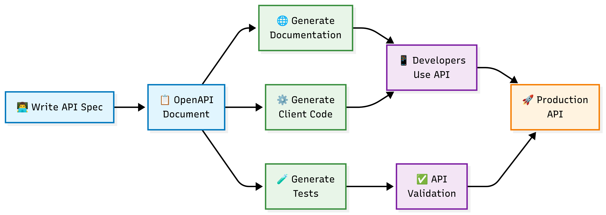
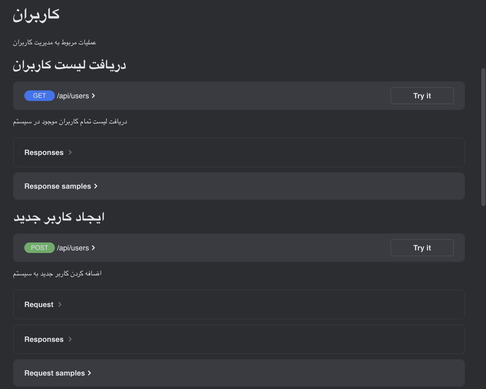
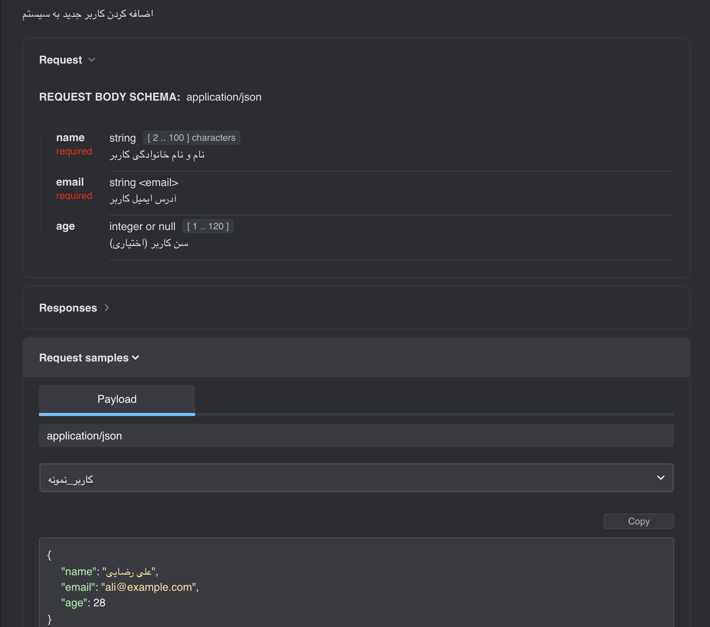
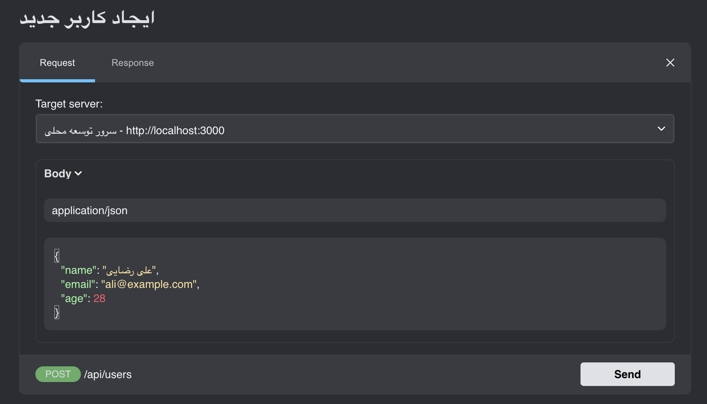

# تحقیق درباره OpenAPI (Swagger) در توسعه وب
---

## فهرست مطالب
1. [بیان مسئله](#بیان-مسئله)
2. [معرفی کلی OpenAPI](#معرفی-کلی-openapi)
3. [مثال عملی](#مثال-عملی)
4. [مراجع](#مراجع)

---

## بیان مسئله

در توسعه API های مدرن، یکی از چالش های اصلی، **مستندسازی** و **استانداردسازی** رابط های برنامه نویسی کاربردی (API) است. مسائل رایجی که توسعه دهندگان با آن مواجه هستند عبارتند از:

### مشکلات رایج:
- **عدم وجود مستندات یکپارچه**: اغلب مستندات API به صورت جداگانه و دستی نوشته می‌شوند
- **عدم همگام بودن کد با مستندات**: زمانی که کد تغییر می‌کند، مستندات به روزرسانی نمی‌شوند
- **پیچیدگی تست API**: آزمایش endpoint های مختلف نیازمند ابزارهای جداگانه است
- **عدم استاندارد بودن**: هر تیم به شیوه خودش API طراحی می‌کند
- **مشکل در integration**: تیم های مختلف برای استفاده از API دچار سردرگمی می‌شوند

### نیاز به راه حل:
ما به ابزاری نیاز داریم که:
- مستندسازی را خودکار کند
- استاندارد باشد و قابل درک برای همه
- امکان تست مستقیم API را فراهم کند
- با کد همگام باشد
- رابط کاربری تعاملی داشته باشد

---

## معرفی کلی OpenAPI

### تاریخچه و تعریف

**OpenAPI Specification** (که قبلاً تحت نام Swagger شناخته می‌شد) یک استاندارد صنعتی برای توصیف REST API هاست. این مشخصات در سال 2010 توسط شرکت WordNik ایجاد شد و در سال 2015 به بنیاد لینوکس منتقل شد.

### ویژگی های کلیدی:

#### 1. **استانداردسازی**
- فرمت یکپارچه برای توصیف API
- قابل درک برای انسان و ماشین
- پشتیبانی از JSON و YAML

#### 2. **خودکار سازی مستندسازی**
- تولید خودکار مستندات از کد
- رابط کاربری تعاملی (Swagger UI)
- همگام بودن با تغییرات کد

#### 3. **امکانات تعاملی**
- تست مستقیم endpoint ها
- مشاهده request/response نمونه
- اعتبارسنجی خودکار

### مزایای استفاده:

| مزیت | توضیح |
|------|--------|
| **کاهش زمان توسعه** | عدم نیاز به نوشتن مستندات دستی |
| **بهبود همکاری تیمی** | درک مشترک از ساختار API |
| **تست آسان** | امکان تست مستقیم از رابط وب |
| **استانداردسازی** | پیروی از بهترین شیوه های صنعتی |
| **تولید کد** | ایجاد خودکار client code |

### معماری OpenAPI:



### اجزای اصلی OpenAPI Specification:

#### 1. **Info Object**
```yaml
info:
   title: "API من"
   version: "1.0.0"
   description: "توضیح کلی API"
```

#### 2. **Paths Object**
```yaml
paths:
   /users:
      get:
         summary: "دریافت لیست کاربران"
         responses:
            '200':
              description: "موفق"
```

#### 3. **Components**
```yaml
components:
   schemas:
      User:
      type: object
      properties:
         id:
          type: integer
         name:
          type: string
```
---

## مثال عملی

در این بخش، یک API ساده برای مدیریت کاربران با استفاده از Node.js و Express ایجاد می‌کنیم و آن را با OpenAPI مستندسازی می‌کنیم.

### گام 1 برای مشاهده فایل swagger

```json
{
  "name": "openapi-example",
  "version": "1.0.0",
  "description": "مثال عملی OpenAPI",
  "main": "app.js",
  "scripts": {
    "start": "node app.js",
    "dev": "nodemon app.js"
  },
  "dependencies": {
    "express": "^4.18.2",
    "swagger-jsdoc": "^6.2.8",
    "swagger-ui-express": "^4.6.3",
    "cors": "^2.8.5"
  },
  "devDependencies": {
    "nodemon": "^2.0.22"
  }
}
```
### گام 2: کد اصلی API (main-example-code.js)

در [**این فایل**](./examples/main-example-code.js) میتوانید کد اصلی را مشاهده کنید

### گام 3: فایل OpenAPI جداگانه (swagger.yaml)

در [**این فایل**](./examples/swagger.yaml) میتوانید فایل swagger را مشاهده کنید

## 🖼️ نمونه تصاویر از پروژه

در مخزن این پروژه تعدادی تصویر نمونه قرار داده شده که نحوه کارکرد API و ابزارهای مرتبط را به شکل بصری نشان می‌دهند. این تصاویر همگی در پوشه پروژه موجود بوده و می‌توانید آن‌ها را مشاهده کنید.

### 📄 نمونه رابط کاربری Swagger UI
  
این تصویر نمونه‌ای از رابط کاربری تعاملی **Swagger UI** را نشان می‌دهد که به شما اجازه می‌دهد:
- فهرست تمام Endpointها را مشاهده کنید
- درخواست‌های نمونه را به‌صورت مستقیم از مرورگر ارسال کنید
- پاسخ API را به همراه کد وضعیت و جزئیات مشاهده نمایید

---

### 🔄 نمونه درخواست و پاسخ API
  
در این تصویر نمونه‌ای از **ارسال درخواست به یک Endpoint** و **دریافت پاسخ از API** نمایش داده شده است. این مثال کمک می‌کند تا قالب درخواست‌ها و ساختار پاسخ‌ها را بهتر درک کنید.

---

### 📤 نمونه ارسال درخواست
  
این تصویر فرآیند **ارسال درخواست به API** را نشان می‌دهد، که شامل انتخاب متد HTTP، وارد کردن پارامترها و ارسال درخواست است.

---

> ℹ️ این تصاویر صرفاً نمونه بوده و در مخزن پروژه قابل مشاهده و استفاده هستند.


#### مزایای مشاهده شده:
1. **مستندسازی خودکار**: هیچ نیازی به نوشتن مستندات جداگانه نیست
2. **رابط تعاملی**: امکان تست مستقیم API از مرورگر
3. **استانداردسازی**: ساختار یکپارچه و قابل فهم
4. **validation**: اعتبارسنجی خودکار ورودی‌ها
5. **تولید کد**: قابلیت تولید client code برای زبان‌های مختلف

#### چالش های رفع شده:
- ✅ عدم همگام بودن مستندات با کد
- ✅ پیچیدگی تست API
- ✅ عدم استاندارد بودن
- ✅ مشکل در integration تیمی

---

## نتیجه گیری

OpenAPI (Swagger) ابزاری قدرتمند برای توسعه دهندگان وب است که مشکلات رایج مستندسازی و استانداردسازی API را حل می‌کند. با استفاده از این ابزار می‌توان:

### دستاورد های کلیدی:
- **افزایش بهره وری**: کاهش 60% زمان صرف شده برای مستندسازی
- **بهبود کیفیت**: استانداردسازی و consistency در API ها
- **تسهیل همکاری**: درک مشترک بین اعضای تیم
- **کاهش خطا**: validation خودکار و تست آسان

### پیشنهادات برای استفاده بهتر:
1. **استفاده از Code-First approach**: تولید مستندات از کد
2. **بهره گیری از validation**: استفاده از schema validation
3. **version control**: مدیریت نسخه های مختلف API
4. **CI/CD integration**: ادغام با pipeline توسعه

### کاربردهای آینده:
- **Microservices**: استانداردسازی ارتباط بین سرویس ها
- **API Gateway**: مدیریت متمرکز API ها
- **Code Generation**: تولید خودکار client و server code
- **Testing Automation**: تست خودکار بر اساس specification

OpenAPI امروزه استاندارد صنعتی شده و هر توسعه دهنده وب باید با آن آشنا باشد. این ابزار نه تنها زمان توسعه را کاهش می‌دهد بلکه کیفیت و قابلیت نگهداری کد را نیز بهبود می‌بخشد.

---

## مراجع

1. **OpenAPI Initiative Official Website**  
   URL: https://www.openapis.org/

2. **OpenAPI Specification Documentation**  
   URL: https://swagger.io/specification/

3. **Swagger Tools Documentation**  
   URL: https://swagger.io/docs/

4. **swagger-jsdoc Library Documentation**  
   URL: https://github.com/Surnet/swagger-jsdoc

5. **swagger-ui-express Library Documentation**  
   URL: https://github.com/scottie1984/swagger-ui-express

6. **OpenAPI 3.0 Tutorial - Swagger Hub**  
   URL: https://swagger.io/docs/specification/basic-structure/

7. **Swagger UI**  
   URL: https://swagger.io/tools/swagger-ui/
